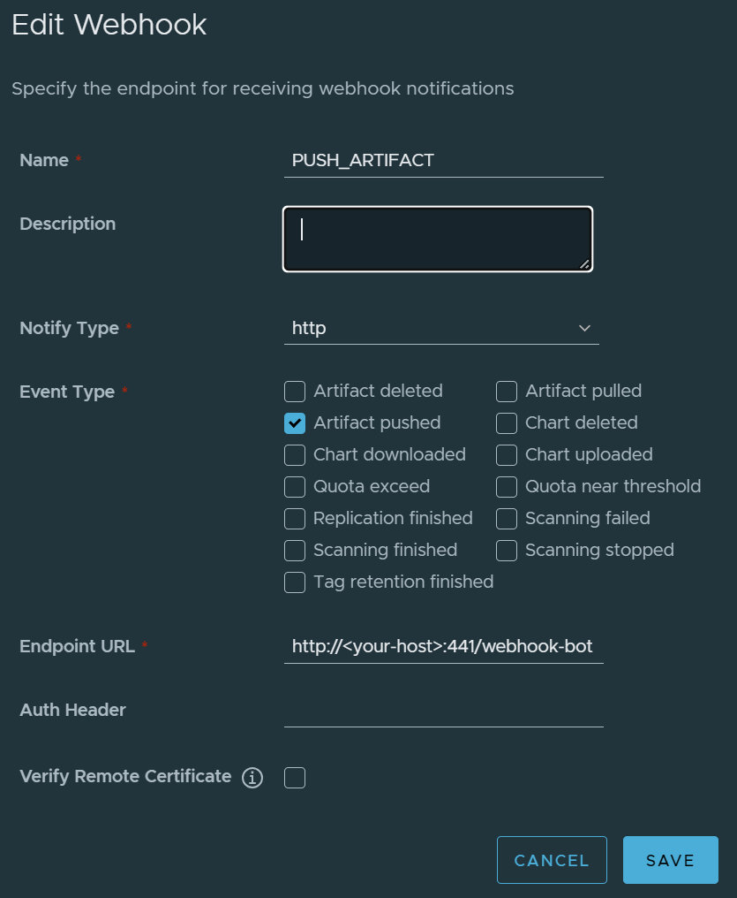
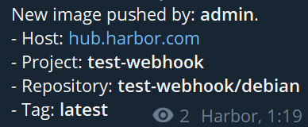

# Harbor-Bot

[](https://github.com/AlexPokatilov/Harbor-Telegram-Bot/actions/workflows/docker.yml)
[](https://github.com/AlexPokatilov/Harbor-Telegram-Bot/actions/workflows/go-lint.yml)

Harbor - Telegram bot. Notify about new image pushes to harbor container registry.

## Release v1.0.0

- Support only "PUSH_ARTIFACT" event type.

## Getting started

### Pre-requirements

- Create Telegram Bot with [BotFather](https://core.telegram.org/bots/features#botfather).
- Get Bot API Token.
- Get your ChatID (example):
    - public: `https:/t.me/MY_CHAT`
    - [private](https://telegram-bot-sdk.readme.io/reference/getupdates): `-2233445566778`
- Add your bot to chanel or group with admin rules (messages access).

### Install

- To start Bot, run the following command with your variables in terminal:

    ``` bash
    docker run -it -p 441:441
        --name harbor-telegram-bot
        -e DEBUG_MODE=true
        -e CHAT_ID=<you-chat-id>
        -e BOT_TOKEN=<your-bot-api-token>
        alexpokatilov/harbor-telegram-bot:latest
    ```

    If you want to hide your webhook data at logs - user `DEBUG_MODE=false`.

- Configure your Harbor `http` webhook:

    

- Check your bot. Send POST request to `http://<your-host>:441/webhook-bot`:

    Body (raw)
    ```json
    {
        "type": "PUSH_ARTIFACT",
        "occur_at": 1586922308,
        "operator": "admin",
        "event_data": {
            "resources": [{
                "digest": "sha256:8a9e9863dbb6e10edb5adfe917c00da84e1700fa76e7ed02476aa6e6fb8ee0d8",
                "tag": "latest",
                "resource_url": "hub.harbor.com/test-webhook/debian:latest"
            }],
            "repository": {
                "date_created": 1586922308,
                "name": "debian",
                "namespace": "test-webhook",
                "repo_full_name": "test-webhook/debian",
                "repo_type": "private"
            }
        }
    }
    ```

    Bot message:

    

## Links

### Releases

- [Docker Hub](https://hub.docker.com/r/alexpokatilov/harbor-telegram-bot)

### Ref links

- [github.com/go-telegram-bot-api/telegram-bot-api/v5](https://pkg.go.dev/github.com/go-telegram-bot-api/telegram-bot-api/v5@v5.5.1)
- [github.com/technoweenie/multipartstreamer](https://pkg.go.dev/github.com/technoweenie/multipartstreamer@v1.0.1)
